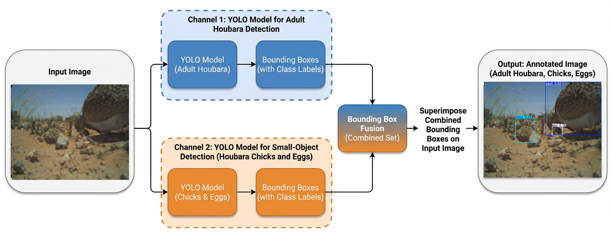
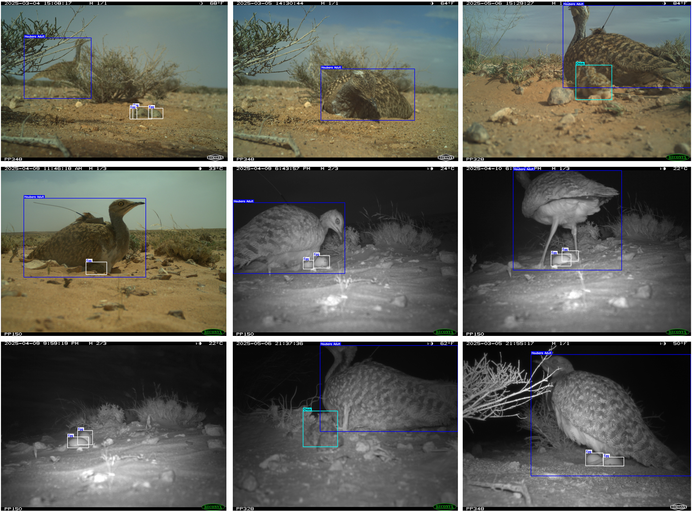
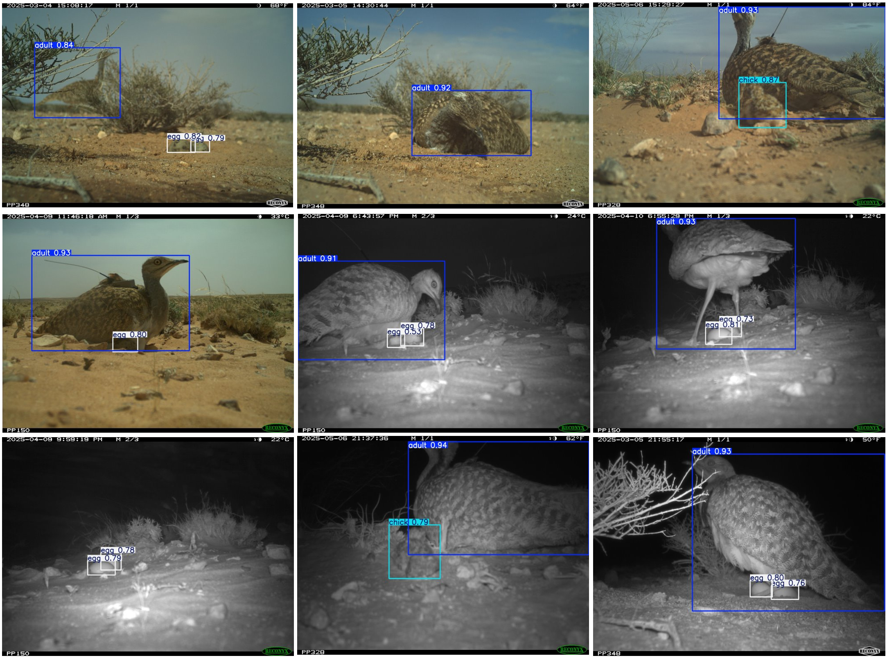
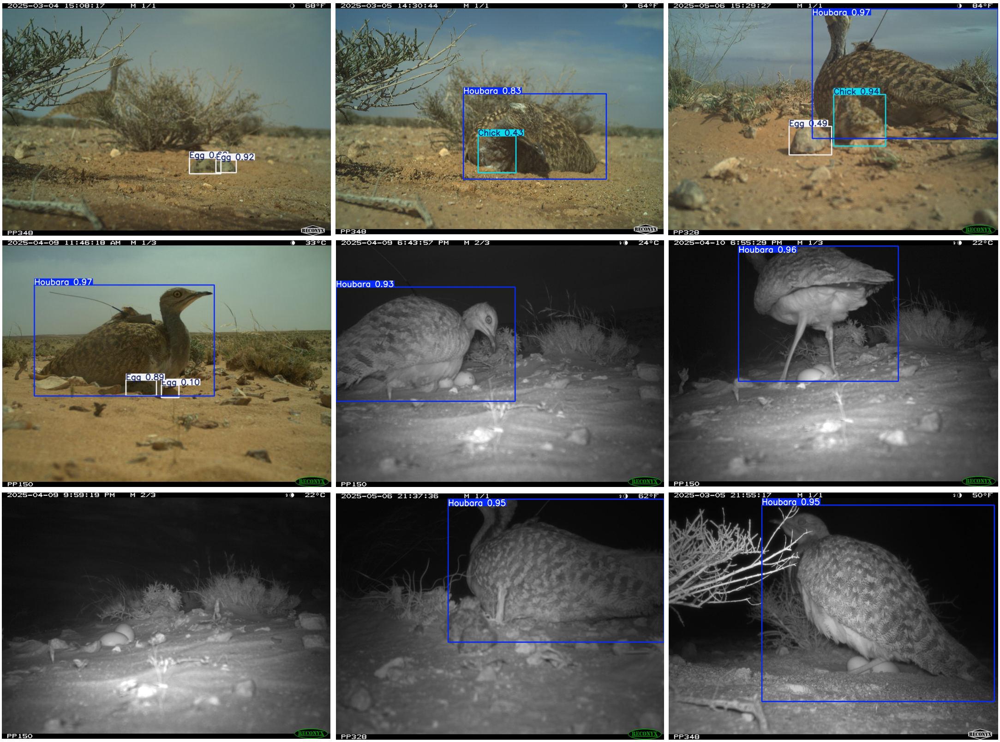

# AI-Driven Monitoring of Breeding in Vulnerable Houbara Bustards

## A Multi-Region Camera-Trap Dataset, an Open Annotation Tool, and a Dual-Channel Detection Method

<p align="center">
  
</p>

<p align="center">
  <b>Research status:</b> This research is currently under review.
</p>

---

## Overview

Monitoring houbara bustard nests is important for conservation, but camera-trap deployments generate large image streams that are difficult to inspect manually. This repository accompanies our research on AI-assisted monitoring of houbara bustard breeding, with a focus on detecting three nest-related classes:

- **Adult Houbara Bustard**
- **Chick**
- **Egg**

The study introduces an extended multi-year, multi-region camera-trap dataset, a lightweight browser-based annotation tool, and a dual-channel object detection method designed to improve the detection of small and cryptic nest contents, especially chicks and eggs.

---

## Paper

**Title:** AI-Driven Monitoring of Breeding in Vulnerable Houbara Bustards: A Multi-Region Camera-Trap Dataset, an Open Annotation Tool, and a Dual-Channel Detection Method

**Authors:** Syed Sadaf Ali, Iyyakutti Iyappan Ganapathi, Syed Danish Ali, Christelle Lucas, Eric Le Nuz, Thibault Dieuleveut, Mubarak Yakubu, Naoufel Werghi, Yves Hingrat, Loic Lesobre, Irfan Hussain, Sajid Javed, and Enrico Sorato

**Status:** Under review

---

## Dataset Summary

The extended HBCE dataset contains camera-trap images collected from houbara nests across multiple regions and years. It includes both RGB daytime images and infrared night-time images, covering challenging real-world conditions such as low light, motion blur, occlusion, backlighting, cluttered backgrounds, and camouflage.

| Category | Number of Images | Number of Instances |
|---|---:|---:|
| Houbara adults | 10,617 | 10,658 |
| Houbara chicks | 7,120 | 9,141 |
| Houbara eggs | 9,147 | 16,877 |
| **Total** | **16,300** | **36,676** |

### Dataset Split

| Subset | Number of Images |
|---|---:|
| Training | 13,040 |
| Validation | 3,260 |
| **Total** | **16,300** |

---

## Sample Images from the Dataset

<p align="center">
  
</p>

The dataset includes diverse nest scenes with adult houbaras, chicks, and eggs under different illumination, viewpoint, and background conditions.

---

## Annotation Tool

We developed a user-friendly HTML-based annotation tool for drawing, editing, and exporting bounding-box annotations. The tool is designed for ecologists and conservation practitioners who need a simple local annotation workflow without complex server setup.

Key features include:

- Runs locally in a modern web browser
- Supports bounding-box drawing, moving, resizing, and deletion
- Supports configurable class labels
- Exports one JSON annotation file per image
- Provides keyboard shortcuts for faster annotation
- Supports visual inspection and correction of existing annotations

<p align="center">
  
</p>

---

## Ground-Truth Annotations

<p align="center">
  
</p>

Each visible adult, chick, and egg is annotated using an axis-aligned bounding box. Special attention is given to small, partially occluded, and camouflaged eggs and chicks.

---

## Proposed Dual-Channel Detection Method

The proposed method addresses the scale imbalance between large adult birds and very small nest contents. Instead of training a single detector for all classes, the method uses two specialized YOLO-based channels:

1. **Channel 1: Adult-YOLO**  
   Detects adult houbara bustards from full-frame images.

2. **Channel 2: Nest-YOLO**  
   Detects small nest contents, especially chicks and eggs, at higher effective image resolution.

3. **Bounding-box fusion**  
   Combines adult, chick, and egg detections into a single annotated output image.

<p align="center">
  
</p>

---

## Qualitative Results

### Proposed Method

<p align="center">
  
</p>

### YOLOv26 Baseline

<p align="center">
  
</p>

The proposed dual-channel method improves detection of small chicks and eggs in difficult scenes, including low-light, infrared, occluded, and cluttered nest environments.

---

## Benchmark Summary

| Method | Adult AP50 | Chick AP50 | Egg AP50 | mAP50 | mAP0.5:0.95 |
|---|---:|---:|---:|---:|---:|
| YOLOv26 baseline | 91.6 | 88.4 | 84.2 | 88.1 | 62.9 |
| **Proposed Method** | **91.9** | **90.7** | **87.7** | **90.1** | **65.4** |

### Gain over YOLOv26 Baseline

| Metric | Gain |
|---|---:|
| Adult AP50 | +0.3 |
| Chick AP50 | +2.3 |
| Egg AP50 | +3.5 |
| mAP50 | +2.0 |
| mAP0.5:0.95 | +2.5 |

---

## Applications

This dataset and framework can support:

- Automated houbara nest monitoring
- Breeding success analysis
- Detection of adults, chicks, and eggs in camera-trap imagery
- Development of small-object-aware wildlife detection models
- Conservation decision support
- Transfer learning for other bustard and ground-nesting bird species

---

## Repository Structure

A suggested repository structure is:

```text
.
├── README.md
├── assets/
│   ├── annotation_tool.png
│   ├── dataset.png
│   ├── dataset_gt.png
│   ├── dataset_Proposed_technique.png
│   ├── dataset_yolov26.png
│   └── f4.png
├── annotation_tool/
│   └── KU_Image_Annotator.html
├── data/
│   └── README.md
├── models/
│   └── README.md
└── results/
    └── README.md
```

---

## Code and Dataset Access

This research is currently under review. For codes and dataset access, kindly send an email to:

**iit.sadaf@gmail.com**

---

## Citation

The manuscript is currently under review. Citation details will be updated after acceptance.

```bibtex
@article{ali2026houbara_breeding_monitoring,
  title   = {AI-Driven Monitoring of Breeding in Vulnerable Houbara Bustards: A Multi-Region Camera-Trap Dataset, an Open Annotation Tool, and a Dual-Channel Detection Method},
  author  = {Ali, Syed Sadaf and Ganapathi, Iyyakutti Iyappan and Ali, Syed Danish and Lucas, Christelle and Le Nuz, Eric and Dieuleveut, Thibault and Yakubu, Mubarak and Werghi, Naoufel and Hingrat, Yves and Lesobre, Loic and Hussain, Irfan and Javed, Sajid and Sorato, Enrico},
  journal = {Under review},
  year    = {2026},
  note    = {Manuscript under review}
}
```

---

## Acknowledgments

This research has been supported by the International Fund for Houbara Conservation (IFHC) and Khalifa University under the project titled **AI-based Houbara Scene and Behavioral Understanding**. Samples used in this study were provided by IFHC and collected under the guidance of Reneco International Wildlife Consultants.

---

## Contact

For questions about the code, dataset, annotation tool, or research collaboration, please contact:

**iit.sadaf@gmail.com, syed.ali@ku.ac.ae**
